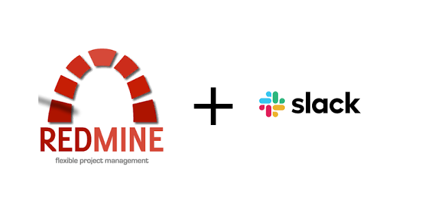

# Task manager using Redmine



This repository contains the config file and guide to run Redmine App in server to manage tasks.

### Start app

1. Install docker in target server
2. Run command: ```docker-compose up```

### Some instructions

#### To install plugin for Redmine

1. Run command: ```docker exec -ti redmine_redmine_1 gosu redmine bash``` to connect to container bash. In this command: 
- `redmine_redmine_1` is the container name
- `redmine` is the image name

2. Change directory to `plugins` folder and clone/download plugin.
3. Restart redmine.

#### To notify to Slack channel

Use Redmine-Slack plugin [Original link here - sciyoshi version](https://github.com/sciyoshi/redmine-slack.git).

But I need to notify clear messages, so I forked that repository and customize message. [Link my version here - khanhtrancse](https://github.com/khanhtrancse/redmine-slack.git)
- `ToDo` status: Not notify
- `Doing` status: Message: **User** đang làm **feature** - **[Project]**
- `Done` status: Message: **User** đã hoàn thành **feature** - **[Project]**

To use my redmine-slack version:
1. Install plugin. [https://github.com/khanhtrancse/redmine-slack.git](https://github.com/khanhtrancse/redmine-slack.git)
2. Create the status: `ToDo`, `Doing`, `Done`.
3. Create Slack app to get Webhook link. [Guide here](https://api.slack.com/messaging/webhooks)
4. Go to Redmine Admin Wed, and config redmine-slack plugin.